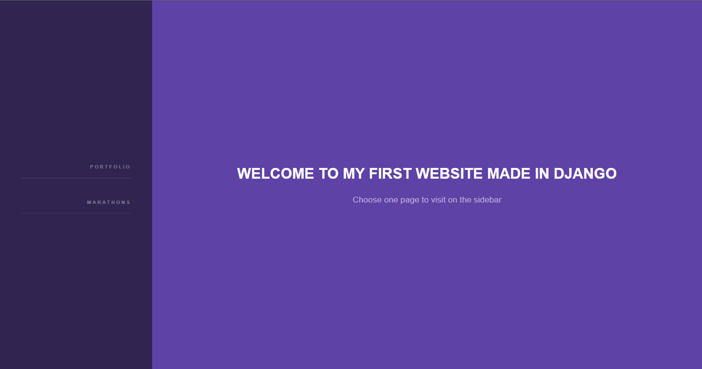

# Portifolio in Django

This is my first django ptoject, and I developed a portifolio about me and competitions I have participated.
<br><br>

Click in the image below to watch how my website works...
[](https://www.youtube.com/watch?v=DyDwNoZLQ9w)
<br><br>

Or run in your machine the following comands
```
git clone https://github.com/JoaoAssalim/Django-Portifolio.git
pip install -r requirements.txt
cd Django-Portifolio
cd myapp
python manage.py runserver
```
